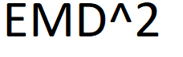

&nbsp;

&nbsp; 
[](https://www.nuget.org/packages/EMDD.KtGeometry/)[](https://www.nuget.org/stats/packages/EMDD.KtGeometry?groupby=Version&groupby=ClientName&groupby=ClientVersion)[](https://github.com/marlond18/EMDD.KtGeometry/actions/workflows/Run%20Test.yml)
&nbsp;

# EMDD.KtGeometry
____________________
a library implementation of geometrical objects

## Requirements/Dependencies

[.Net 5.0.102 sdk](https://dotnet.microsoft.com/download/dotnet/5.0) or greater

[EMDD.KtCircularStack](https://www.nuget.org/packages/EMDD.KtCircularStack/)

## Nuget Package Usage

https://www.nuget.org/packages/EMDD.KtGeometry/

`<PackageReference Include="EMDD.KtGeometry" Version="1.*.*" />`

## Usage
- this library can be used to represent geometrical objects such as lines and plane as class type.

### Vectors
- Vectors can be 2D or 3D through `EMDD.KtGeometry.KtVectors.KtVector2D` and `EMDD.KtGeometry.KtVectors.KtVector3D` respectively.

### Points
- Points can be 2D or 3D through `EMDD.KtGeometry.KtPoints.KtPoint2D` and `EMDD.KtGeometry.KtPoints.KtPoint3D` respectively.

### Lines
- Lines can be of type `KtLine2D`, `KtRay2D`, `KtSegment2D`, or `KtLine3D`
```c#
var line = new EMDD.KtGeometry.KtLines._2D.KtLine2D(2,3,-12, 3);

var startPoint = new EMDD.KtGeometry.KtPoints.KtPoint2D(2,3); 
var direction = new EMDD.KtGeometry.KtVectors.KtVector2D(-1,4);
var endPoint = new EMDD.KtGeometry.KtPoints.KtPoint2D(5,5); 

var ray = new EMDD.KtGeometry.KtLines._2D.KtRay2D(startPoint, direction);
var segment = new EMDD.KtGeometry.KtLines._2D.KtSegment2D(startPoint, endPoint);
```
- Line methods includes line properties such as angle, intersepts and calculation of intersection points, distance from a point

### KtPlane
- plane object
```c#
var plane = new EMDD.KtGeometry.KtPlanes.KtPlane(2,3,-12, 3); //2x + 3y - 12z = 3
```
- able to calculate intesection with plane and line

### KtPolygon
- polygons bound by edges
```c#
// a polygon contains a list of regions, where these regions can be +(addition/solid) or -(deductive/hollow)
var startPoint = new EMDD.KtGeometry.KtPoints.KtPoint2D(2,3); 
var rectRegion = EMDD.KtGeometry.KtPolygons.CreateSpecialRegionMethods.Rectangle(startPoint, 20, 40, true);

var plane = new EMDD.KtGeometry.KtPolygons.KtPolygon2D(rectRegion);
```

- Polygon method includes:
	- Area calculation
	- Polygon clipping
	- Translation/rotation
### Quaternions
- representation of graphical rotation and orientation of objects 
```c#
var quatern= new KtQuaternion(w, x, y,z);
```
### todo
- better documentation
